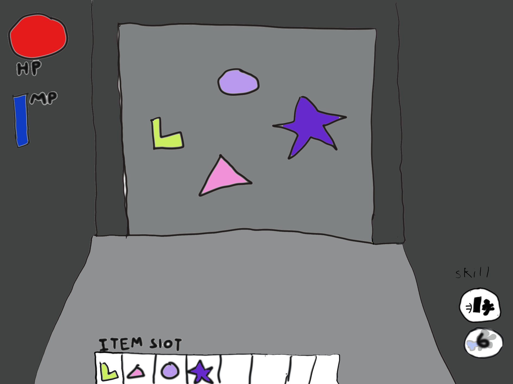

# 프로젝트명: EsCafe

# [컨셉]

## 메인컨셉 : 방탈출

- 지속적인 컨텐츠 추가가 가능한 퍼즐 추리 형태의 게임.

1인칭으로 개발하며 플레이 하는 사람이 몰입할 수 있고 부가적인 퍼즐 형식의 방탈출로 유저가 흥미를 느끼고 탈출 한다는 몰입감을 느끼게 해주는 것이 목표

### 서브 컨셉 1 : 몰입감

단순히 움직이면서 방을 탈출하는게 아닌, 유저가 직접 작동하는 사물을 통해서 게임내의 요소와 상호작용함.

### 서브 컨셉 2 : 1인칭

1인칭 시점으로 마치 내가 현장에 있는 느낌으로 게임을 플레이 할 수 있음.

3인칭 게임은 보다 시야가 넓어 현장에 있다는 몰입감을 받기 힘든 점이 있다.

게임의 컨텐츠 사물과의 상호작용을 통해 1인칭으로 게임을 플레이하면서 유저가 게임에 흥미롭게 다가갈 수 있음
### 서브 컨셉 3 : 퍼즐(미니게임)

게임의 핵심적인 부가적인 요소

유저는 기존의 방 탈출 게임에서 보지 못했던 퍼즐(미니게임)을 풀면서 길을 열거나 특정한 능력을 얻을 수 있음.

유저가 성취감을 느끼며 합당한 보상을 받게 하는것이 목표.

### 서브 컨셉 4 : 특수 능력

유저는 퍼즐(미니게임)을 풀거나 방을 클리어 했을 시 , 이에 대한 보상으로 능력이 주어짐.

능력에는 순간이동, 빠른 걸음, 미니 게임 시간 제한 늘리기

게임의 목적은 플레이 하는 유저가 보상감을 느껴야 하는게 목적임으로 그에 걸맞는 컨텐츠를 구상함.

### 서브 컨셉 5 : 성장성

지속 개발 가능한 상호작용 컨텐츠와 부가적인 게임 내적 요소들을 통해 끊임없이 유지 보수, 추가 할 수 있는 게임 개발. (ex : ai추가)

  

# [관련 이미지 & 동영상]

- 이미지  
  
- 동영상
  

  

# [대표 이미지]

  

# [대표이미지 기반 작품묘사]

> ### 대표이미지 기반 :

# [<"EsCafe"> 구성 요소]
 
- 긴장과 성취감 그리고 몰입을 할 수있는 탈출 게임

## 1. 메커니즘

[도전 과제]

1. 주어진 시간내에 능력을 깨닫고 탈출해야함.
2. 문에 새겨진 잠금장치를 풀기위해 퍼즐을 풀어야함.

[재미 요소]

1. 게임을 진행하기 위해선 단순 지형 지물을 피해가는 것이 아닌
상호작용하기 위해 설계된 미니게임들을 풀어 나가야함.

2. 유저는 게임을 플레이하며 조건 등을 달성할 시 새로운 능력들
을 얻을 수 있음.

3. 시간 제한을 기반으로 유저에게 확실한 목표를 심어주며 미니
게임 등을 플레이하여 유저가 성취감을 느끼게 해 줌.

 

## 2. 이야기

[만들게 된 배경]  
관심있던 방탈출 게임에 바이오하자드와 같이 서바이벌 호러 장르 게임을 추가해 만들고 싶어 시도하게 되었습니다. 

[카메라 관점]  
시야에 제한을 두어 공포감을 조성하고자 1인칭으로 설정함.

 

## 3. 미적요소

[디자인]

플레이 하는 사람으로 하여금 긴장감과 몰입감을 주기 위해 어둡게 설정
벽돌과 횟불등을 사용하여 효과를 줌.

[음향]  

어둡고 소름돋는 음악을 사용함.
남은시간이 적거나 적이 가까이 있을수록 템포를 높여 긴장감을 조성함.

 

## 4. 기술
Unity 사용

# [게임 시스템 디자인]

## 1. 게임 오브젝트 분해

|연번|오브젝트 이름|오브젝트 이미지|
|:----:|:----:|:----:|
|1|축구장||
|2|골대||
|3|홍길동선수||
|4|골킵||

