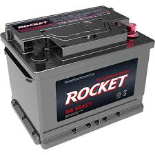
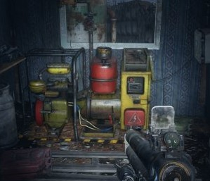
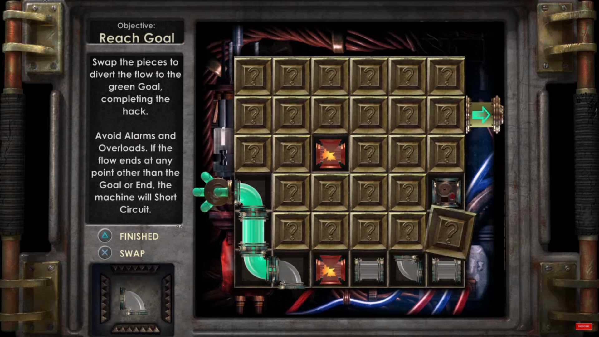

# 프로젝트명: EsCafe

# [ 목차 ]

### 1. [컨셉](#메인컨셉--방탈출)
### 2. [관련 이미지와 동영상](#관련-이미지--동영상)
### 3. [대표 이미지 그리고 컨셉과 대표이미지 기반 작품 묘사](#대표-이미지)
### 4. [<"EsCafe"> 구성 요소](#escafe-구성-요소)
### 5. [게임 시스템 디자인](#게임-시스템-디자인)
### 6. [요구사항](#요구사항)
### 7. [시간별 흐름도](#시간별-흐름도)
### 8. [키보드 이벤트에 대한 흐름도](#키보드-이벤트에-대한-흐름도)
### 9. [용어정리](#용어정리)

# [컨셉]

## 메인컨셉 : 방탈출

- 지속적인 컨텐츠 추가가 가능한 퍼즐 추리 형태의 게임.

1인칭으로 개발하며 플레이 하는 사람이 몰입할 수 있고 부가적인 퍼즐 형식의 방탈출로 유저가 흥미를 느끼고 탈출 한다는 몰입감을 느끼게 해주는 것이 목표

### 서브 컨셉 1 : 몰입감

단순히 움직이면서 방을 탈출하는게 아닌, 유저가 직접 작동하는 사물을 통해서 게임내의 요소와 상호작용함.

### 서브 컨셉 2 : 1인칭

1인칭 시점으로 마치 내가 현장에 있는 느낌으로 게임을 플레이 할 수 있음.

3인칭 게임은 보다 시야가 넓어 현장에 있다는 몰입감을 받기 힘든 점이 있다.

게임의 컨텐츠 사물과의 상호작용을 통해 1인칭으로 게임을 플레이하면서 유저가 게임에 흥미롭게 다가갈 수 있음
### 서브 컨셉 3 : 퍼즐(미니게임)

게임의 핵심적인 부가적인 요소

유저는 기존의 방 탈출 게임에서 보지 못했던 퍼즐(미니게임)을 풀면서 길을 열거나 특정한 능력을 얻을 수 있음.

유저가 성취감을 느끼며 합당한 보상을 받게 하는것이 목표.

### 서브 컨셉 4 : 특수 능력

유저는 퍼즐(미니게임)을 풀거나 방을 클리어 했을 시 , 이에 대한 보상으로 능력이 주어짐.

능력에는 순간이동, 빠른 걸음, 미니 게임 시간 제한 늘리기

게임의 목적은 플레이 하는 유저가 보상감을 느껴야 하는게 목적임으로 그에 걸맞는 컨텐츠를 구상함.

### 서브 컨셉 5 : 성장성

지속 개발 가능한 상호작용 컨텐츠와 부가적인 게임 내적 요소들을 통해 끊임없이 유지 보수, 추가 할 수 있는 게임 개발. (ex : ai추가)

  

# [관련 이미지 & 동영상]

- 이미지  
  
- 동영상
  

  

# [대표 이미지]

  

# [대표이미지 기반 작품묘사]

> ### 대표이미지 기반 :

# [<"EsCafe"> 구성 요소]
 
- 긴장과 성취감 그리고 몰입을 할 수있는 탈출 게임

## 1. 메커니즘

[도전 과제]

1. 주어진 시간내에 능력을 깨닫고 탈출해야함.
2. 문에 새겨진 잠금장치를 풀기위해 퍼즐을 풀어야함.

[재미 요소]

1. 게임을 진행하기 위해선 단순 지형 지물을 피해가는 것이 아닌
상호작용하기 위해 설계된 미니게임들을 풀어 나가야함.

2. 유저는 게임을 플레이하며 조건 등을 달성할 시 새로운 능력들
을 얻을 수 있음.

3. 시간 제한을 기반으로 유저에게 확실한 목표를 심어주며 미니
게임 등을 플레이하여 유저가 성취감을 느끼게 해 줌.

 

## 2. 이야기

[만들게 된 배경]  
관심있던 방탈출 게임에 바이오하자드와 같이 서바이벌 호러 장르 게임을 추가해 만들고 싶어 시도하게 되었습니다. 

[카메라 관점]  
시야에 제한을 두어 공포감을 조성하고자 1인칭으로 설정함.

 

## 3. 미적요소

[디자인]

플레이 하는 사람으로 하여금 긴장감과 몰입감을 주기 위해 어둡게 설정
벽돌과 횟불등을 사용하여 효과를 줌.

[음향]  

어둡고 소름돋는 음악을 사용함.
남은시간이 적거나 적이 가까이 있을수록 템포를 높여 긴장감을 조성함.

 

## 4. 기술
Unity 사용

# [게임 시스템 디자인]

## 1. 게임 오브젝트 분해

|연번|오브젝트 이름| 이미지|
|:----:|:----:|:----:|
|1|플레이어||
|2|횃불||
|3|배터리||
|4|발전기||
|5|승강기||
|6|통신기||
|7|미니게임||

## 2. 파라미터(속성)뽑아 보기

### 1) 오브젝트 이름 : 횃불

|속성|영문 명칭|설명|비고|
|:----:|:----:|:----:|:----:|
|빛|light|어두운 공간속을 밝혀주는 값|0,1|

### 2) 오브젝트 이름 : 배터리

|속성|영문 명칭|설명|비고|
|:----:|:----:|:----:|:----:|
|전기|electric|발전기에 동력원이 되는 파라미터|0,1|

### 3) 오브젝트 이름 : 발전기

|속성|영문 명칭|설명|비고|
|:----:|:----:|:----:|:----:|
|전기|electric|발전기에 동력원이 되는 파라미터|0,1|
|충전량|storage|한번의 충전되는 전력량을 나타내주는 값|40|
|최대용량|maxstorage|충전 가능한 전력량의 최대치로 한계치를 의미|0,100|

### 4) 오브젝트 이름 : 승강기

|속성|영문 명칭|설명|비고|
|:----:|:----:|:----:|:----:|
|상태|L_state|미니게임 활성화 가능 여부를 판단한다.(전력)|0,1|
|활성화|L_activate|미니게임 화면으로 전환된다.|0,1|

### 5) 오브젝트 이름 : 통신기

|속성|영문 명칭|설명|비고|
|:----:|:----:|:----:|:----:|
|상태|T_state|통신이 가능한 상태인지 확인한다. (전력)|0,1|
|활성화|T_activate|통신기를 연결한다.|0,1|
|힌트1|T_MiniHint|미니게임에 대한 힌트를 얻는다.|0,1|
|힌트2|T_GameHint|같은 층내 배터리가 숨겨져있을 위치를 알려준다.|0,1|

### 6) 오브젝트 이름 : 미니게임

|속성|영문 명칭|설명|비고|
|:----:|:----:|:----:|:----:|
|타이머|Timer|게임플레이를 진행할수있는 제한시간|0,300|
||| 추가 예정 ||

## 3. 행동 뽑아 보기

### 오브젝트 이름 : 플레이어

|행동|설명|
|:----:|:----:|
|이동| W, A, S, D 로 플레이어 움직임 제어|
|상호작용|T 로 오브젝트 획득 및 활성화 |
|대쉬|C 버튼을 누를시 초당 5의 에너지를 소모하며 플레이어의 속력 값 일시 증가|
|텔레포트|V 버튼을 누를시 에너지 30소모하며 플레이어가 보고있는 방향으로 좌표 값 50이동|

## 4. 상태 뽑아 보기

### 1) 오브젝트 이름 : 발전기

|현상태|전이상태|전이조건|
|:----:|:----:|:----:|
|배터리 방전|배터리 충전|발전기 배터리 교체|
|배터리 충전|배터리 방전|전력양 전체 소비|

### 2) 오브젝트 이름 : 승강기

|현상태|전이상태|전이조건|
|:----:|:----:|:----:|
|전력차단|전력충전|발전기 배터리 충전|
|전력충전|전력차단|배터리 방전|
|미니게임 비활성화|미니게임 활성화|전력 충전|
|미니게임 활성화|미니게임 비활성화|전력 차단|

### 3) 오브젝트 이름 : 통신기

|현상태|전이상태|전이조건|
|:----:|:----:|:----:|
|전력차단|전력충전|발전기 배터리 충전|
|전력충전|전력차단|배터리 방전|
|대기|통신|플레이어 통신기 상호작용|
|통신|대기상태|통신기 통신종료|

### 4) 오브젝트 이름 : 미니게임

|현상태|전이상태|전이조건|
|:----:|:----:|:----:|
|전력차단|전력충전|발전기 배터리 충전|
|전력충전|전력차단|배터리 방전|
|대기|활성화|승강기  상호작용|
|활성화|대기|미니게임 종료 및 전력차단|

## 5. 플레이어 캐릭터 속성(파라미터)

|속성|영문명칭|설명|비고|
|:----:|:----:|:----:|:----:|
|이동속도|speed|플레이어가 이동시 속도값.|0,1|
|에너지|Energy|대쉬 및 벽통과를 하는데 사용하는 값.     스킬이 지속되지 않을시 초당 5씩 차오른다.|최소 0, 최대 100|

## 6. 게임의 규칙

무너져 내리는 실험실에 갇히기전에 탈출하라.

### 1) 핵심 규칙

- 제한 시간 1시간 이내에 해당 층을 돌파해야함
- 미니게임 시간이 종료되면 미니게임의 설정은 초기화 됨

### 2) 보조 규칙

- 전력 증감

   • 배터리 교체 -> 전력량 40% , 10%당 3분의 시간  
   • 전력사용 오브젝트 활성화 - > 전력량 감소 시작
- 미니게임 타이머

   • 미니게임 활성화 후 시간 감소  
   • 시간증가 스킬 사용시 남은 시간 * 2
   
# [요구사항]

1.  게임을 실행하면 게임 시작 버튼, 환경 설정, 종료 버튼이 있다.
2.  시작화면을 누르면 인트로가 나온다.
3.  환경 설정 버튼을 누르면 소리 On/off 혹은 조절이 나온다.
4.  종료 버튼을 누르면 게임이 종료된다.
5.  인트로에서는 간략한 스토리와 조작법이 나온다.
6.  조작법은 키보드에 WASD 버튼으로 상하좌우로 움직이며 T버튼으로 물체와 상호작용, C/V 버튼으로 기술을 사용한다. 
    인게임 진행중 ESC 버튼을 누를 시 게임을 정지 하고 환경 설정과 게임 종료 버튼이 있는 팝업창이 나옴.
7.  유저가 인트로를 스킵/시간이 지나면 인게임으로 화면이 바뀐다.
8.  인게임 화면에서는 1인칭으로 게임이 진행된다.
9.  게임의 종료는 유저가 종료하고 싶을때 F10 버튼을 누르면 종료된다. 혹은 시간 제한에 실패했을때 종료 여부를 묻는다.
10. 게임은 주어진 시간동안 정해진 맵을 탈출하는, 1인칭 기반의 생존 탈출 장르에 게임이다.
11. 유저는 길을 뚫어가는 과정에서 장애물(문)을 뚫기위해서 미니게임을 플레이 해야한다.
12. 아이템이 존재하며 아이템의 용도는 미니게임을 해금, 발전기에 전력을 넣는데 사용 된다.
13. 유저는 게임을 진행하며 챕터를 클리어하면 스킬을 얻는다.
14. 스킬은 처음 주어지는 대쉬가 있으며, 게임을 진행하며 나머지 스킬들이 해금 된다.
15. 한 게임안에 여러 챕터로 구성되며 유저는 챕터를 클리어시 바로 다음 챕터로 넘어간다.

# [시간별 흐름도]

# [키보드 이벤트에 대한 흐름도]

# [용어정리]

<table>
  <tr>
    <td>No</td>  <td colspan="2">화면</td> <td>용어</td> <td>설명</td>
  </tr>
  <tr>
   <td>1</td> <td rowspan="4">메인메뉴</td> <td rowspan="4">화면요소</td> 
   <td colspan="2">게임을 실행했을때 나오는 메인 메뉴 화면이다. 시작, 환경 설정, 종료 버튼이 있다.</td>
  </tr>
   <tr>
    <td>2</td>  <td>게임 시작 버튼</td> <td>게임 시작 버튼을 누르면 인트로 화면으로 전환된다.</td>
  </tr>
   </tr>
   <tr>
    <td>3</td>  <td>게임 환경 설정</td> <td>환경 설정 버튼을 누르면 환경 설정 화면이 나온다.</td>
  </tr>
  <tr>
    <td>4</td>  <td>게임 종료 버튼</td> <td>게임 종료 버튼을 누르면 게임이 종료된다.</td>
  </tr>
   <tr>
   <td>5</td> <td rowspan="2">인트로</td> <td rowspan="2">화면요소</td> 
   <td>스토리 텍스트</td> <td>환경 설정 버튼을 누르면 환경 설정 화면이 나온다.</td>
  </tr>
  <tr>
    <td>6</td>  <td>조작법 텍스트</td> <td>조작법에 대한 텍스트가 나온다.</td>
  </tr>
  
</table>

