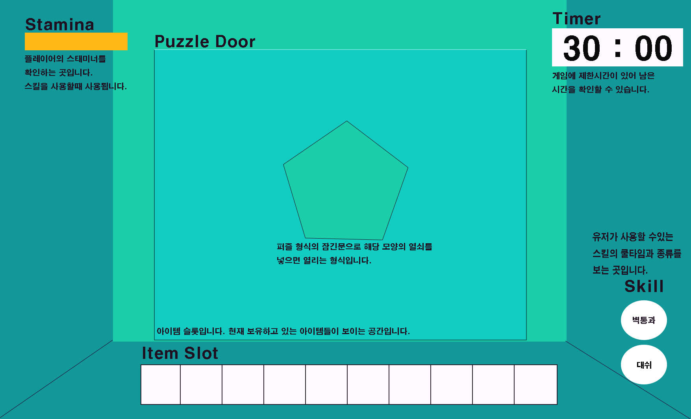

# [ 목차 ]

### 1. [게임명 : EsCafe](#프로젝트명-escafe)
### 2. [컨셉](#메인컨셉--방탈출)
### 3. [관련 이미지와 동영상](#관련-이미지--동영상)
### 4. [대표 이미지](#대표-이미지)
### 5. [작품묘사](#작품묘사)
### 6. [<"EsCafe"> 구성 요소](#escafe-구성-요소)
### 7. [게임 시스템 디자인](#게임-시스템-디자인)
#### a. [게임 오브젝트 분해](#1-게임-오브젝트-분해)
#### b.[파라미터(속성)](#2-파라미터속성)
#### c.[행동](#3-행동)
#### d.[플레이어 캐릭터 속성(파라미터)](#5-플레이어-캐릭터-속성파라미터)
#### e.[게임의 규칙](#6-게임의-규칙)
#### f.[게임에서 사용될 알고리즘](#7-게임에서-사용될-알고리즘)
### 8.[시간별 흐름도](#시간별-흐름도)
### 9.[키보드 이벤트에 대한 흐름도](#키보드-이벤트에-대한-흐름도)
### 10.[구성요소정리](#구성요소정리)

# [프로젝트명: EsCafe]

# [컨셉]

## 메인컨셉 : 방탈출

- 지속적인 컨텐츠 추가가 가능한 퍼즐 추리 형태의 게임.

1인칭으로 개발하며 플레이 하는 사람이 몰입할 수 있고 부가적인 퍼즐 형식의 방탈출로 유저가 흥미를 느끼고 탈출 한다는 몰입감을 느끼게 해주는 것이 목표

### 서브 컨셉 1 : 몰입감

단순히 움직이면서 방을 탈출하는게 아닌, 유저가 직접 작동하는 사물을 통해서 게임내의 요소와 상호작용함.

### 서브 컨셉 2 : 1인칭

1인칭 시점으로 마치 내가 현장에 있는 느낌으로 게임을 플레이 할 수 있음.

3인칭 게임은 보다 시야가 넓어 현장에 있다는 몰입감을 받기 힘든 점이 있다.

게임의 컨텐츠 사물과의 상호작용을 통해 1인칭으로 게임을 플레이하면서 유저가 게임에 흥미롭게 다가갈 수 있음.
### 서브 컨셉 3 : 퍼즐(미니게임)

게임의 핵심적인 부가적인 요소

유저는 기존의 방 탈출 게임에서 보지 못했던 퍼즐(미니게임)을 풀면서 길을 열거나 특정한 능력을 얻을 수 있음.

유저가 성취감을 느끼며 합당한 보상을 받게 하는것이 목표.

### 서브 컨셉 4 : 특수 능력

유저는 퍼즐(미니게임)을 풀거나 방을 클리어 했을 시 , 이에 대한 보상으로 능력이 주어짐.

능력에는 순간이동, 빠른 걸음이 있음.

게임의 목적은 플레이 하는 유저가 보상감을 느껴야 하는게 목적임으로 그에 걸맞는 컨텐츠를 구상함.

### 서브 컨셉 5 : 성장성

지속 개발 가능한 상호작용 컨텐츠와 부가적인 게임 내적 요소들을 통해 끊임없이 유지 보수, 추가 할 수 있는 게임 개발. (ex : ai추가)

  

# [관련 이미지 & 동영상]

- 이미지  
  
- 동영상
  

  

# [대표 이미지]

  

# [작품묘사]

> ### 게임 UI 및 플레이 예시 :

> ### 컨셉 기반: 1인칭으로 몰입하며 막힌 길을 게임을 통해 해금하며 탈출하는 게임

# [<"EsCafe"> 구성 요소]

한줄평 :  
- 긴장과 성취감 그리고 몰입을 할 수있는 탈출 게임

## 1. 메커니즘

[도전 과제]

1. 주어진 시간내에 능력을 깨닫고 탈출해야함.
2. 문에 새겨진 잠금장치를 풀기위해 퍼즐을 풀어야함.
3. 미니게임을 통해 주어진 기믹을 수행해야함.

[재미 요소]

1. 게임을 진행하기 위해선 단순 지형 지물을 피해가는 것이 아닌
상호작용하기 위해 설계된 미니게임들을 풀어 나가야함.

2. 유저는 게임을 플레이하며 조건 등을 달성할 시 새로운 능력들
을 얻을 수 있음.

3. 시간 제한을 기반으로 유저에게 확실한 목표를 심어주며 미니
게임 등을 플레이하여 유저가 성취감을 느끼게 해 줌.

 

## 2. 이야기

[만들게 된 배경]  
관심있던 방탈출 게임에 바이오하자드와 같이 서바이벌 호러 장르 게임을 추가해 만들고 싶어 시도하게 되었습니다. 

[카메라 관점]  
시야에 제한을 두어 공포감을 조성하고자 1인칭으로 설정함.

[게임의 스토리]

1971년. 냉전이 열전으로 변해가고 있을 즈음, 동독일 작센에서는 비인륜적인 생체 실험이 소련에 의해서 자행되고 있었다. 
영국의 특수부대인 SAS출신의 주인공 "앤디 맥넵"은 첩보부인 Mi6의 정보를 바탕으로 생체 실험이 벌어지고 있는 작센의 성으로 자신의 팀과 같이 침투 한다. 
허나 작전의 실패로 팀원중 주인공을 제외한 전원이 사살당하고, 주인공은 모진 고문과 생체실험을 당하게 된다. 
이런 상황에서 주인공이 깨어나 있을때는 자신을 묶고있던 수갑과 족쇄가 풀려있는걸 깨닫는다. 
생체 실험이 일어나고 있던 성에서는 영문 모를 일이 일어나고 있었고 성이 붕괴되는 와중이였다. 
주인공은 성이 붕괴되기 전에 탈출해야 하며 성에 있는 비밀들을 파헤치게 된다.

 

## 3. 미적요소

[디자인]

플레이 하는 사람으로 하여금 긴장감과 몰입감을 주기 위해 어둡게 설정
벽돌과 횟불등을 사용하여 효과를 줌.

[음향]  

어둡고 소름돋는 음악을 사용함.

 

## 4. 기술
Unity 사용

# [게임 시스템 디자인]

## a. 게임 오브젝트 분해

|연번|오브젝트 이름| 이미지|
|:----:|:----:|:----:|
|1|플레이어||
|2|횃불||
|3|승강기||
|4|미니게임||
|5|아이템||

## b. 파라미터(속성)

### 1) 오브젝트 이름 : 플레이어(시점)

|속성|영문 명칭|설명|비고|
|:----:|:----:|:----:|:----:|
|시점|Ca_sight|플레이어가 바라보는 방향을 비추는 카메라 값 |y= (0,180) x= (0,180)|
|타이머|Ca_timer|게임의 제한시간으로 플레이어 시점에 둠 |0, 1800|

### 2) 오브젝트 이름 : 횃불

|속성|영문 명칭|설명|비고|
|:----:|:----:|:----:|:----:|
|빛|Obj_torchlight|어두운 공간속을 밝혀주는 값|0,1|

### 3) 오브젝트 이름 : 승강기

|속성|영문 명칭|설명|비고|
|:----:|:----:|:----:|:----:|
|암호|L_mission|암호가 맞는지 판단한다.|0,1|
|활성화|L_activate|암호가 맞을시 문이 열리며 엔딩으로 향하는길이 열린다.|0,1|

### 4) 오브젝트 이름 : 미니게임

|속성|영문 명칭|설명|비고|
|:----:|:----:|:----:|:----:|
|클릭|M_Click|미니게임의 사진을 눌러 위치를 이동시킴||
|활성화|M_Clear|사진을 올바르게 배열시 미니게임이 클리어된다.||

### 5) 오브젝트 이름 : 아이템

|속성|영문 명칭|설명|비고|
|:----:|:----:|:----:|:----:|
|줍기|I_Get|바라보는 시점에 획득가능 아이템이 있을시 획득 가능하다.|0,1|
|사용|I_Use|아이템의 사용처에 사용가능한 오브젝트를 바라볼시 사용이 가능하다.|0,1|

## c. 행동

### 오브젝트 이름 : 플레이어

|행동|설명|
|:----:|:----:|
|이동| W, A, S, D 로 플레이어 움직임 제어|
|상호작용| 게임내 오브젝트들을 T버튼을 통해 아이템의 경우 획득 및 사용, 특수 기기의 경우 활성화 |
|대쉬| L_Shift 버튼을 누를시 초당 5의 에너지를 소모하며 플레이어의 속력 값 일시 2로 증가|
|텔레포트|F 버튼을 누를시 에너지 20소모하며 플레이어가 보고있는 방향으로 좌표 값 50이동|

## d. 플레이어 캐릭터 속성(파라미터)

|속성|영문명칭|설명|비고|
|:----:|:----:|:----:|:----:|
|이동속도|User_speed|플레이어가 이동시 속도값.|0,2|
|에너지|User_energy|대쉬 및 벽통과를 하는데 사용하는 값. 스킬이 지속되지 않을시 초당 5씩 차오른다.|최소 0, 최대 100|
|아이템 슬롯|User_item|플레이어의 아이템 슬롯으로 아이템을 보관하는 배열||

## e. 게임의 규칙

무너져 내리는 실험실에 갇히기전에 탈출하라.

### 1) 핵심 규칙

- 제한 시간 30분 이내에 해당 건물을 돌파해야함

## f. 게임에서 사용될 알고리즘
 
- 에너지

   • 스킬사용 = 사용가능 에너지 보유시 사용  
   • 대쉬 = 초당 5의 에너지 소모, 에너지 0 or 키다운 해제시 중지   
   • 텔레포트 = 20사용 카메라 시점으로 좌표 50 이동   
   • 회복 = 스킬 미사용 5초 이후부터 초당 5씩 회복    

## [시간별 흐름도]

# [키보드 이벤트에 대한 흐름도]

# [구성요소정리]

<table>
  <tr>
    <td>No</td>  <td colspan="2">화면</td> <td>용어</td> <td>설명</td>
  </tr>
  <tr>
   <td>1</td> <td rowspan="4">메인메뉴</td> <td rowspan="4">화면요소</td> 
   <td colspan="2">게임을 실행했을때 나오는 메인 메뉴 화면이다. 시작, 환경 설정, 종료 버튼이 있다.</td>
  </tr>
   <tr>
    <td>2</td>  <td>게임 시작 버튼</td> <td>게임 시작 버튼을 누르면 인트로 화면으로 전환된다.</td>
  </tr>
   <tr>
    <td>3</td>  <td>게임 환경 설정</td> <td>환경 설정 버튼을 누르면 환경 설정 화면이 나온다.</td>
  </tr>
  <tr>
    <td>4</td>  <td>게임 종료 버튼</td> <td>게임 종료 버튼을 누르면 게임이 종료된다.</td>
  </tr>
   <tr>
   <td>5</td> <td rowspan="2">인트로</td> <td rowspan="2">화면요소</td> 
   <td>스토리 텍스트</td> <td>환경 설정 버튼을 누르면 환경 설정 화면이 나온다.</td>
  </tr>
  <tr>
    <td>6</td>  <td>조작법 텍스트</td> <td>조작법에 대한 텍스트가 나온다.</td>
  </tr>
  <tr>
   <td>7</td> <td rowspan="20">인게임</td> <td rowspan="4">화면요소</td> 
   <td>아이템 슬롯</td> <td>보유한 아이템을 보여 준다.</td>
  </tr>
   <tr>
    <td>8</td>  <td>에너지</td> <td>현재 에너지를 보여준다.</td>
  </tr>
   <tr>
    <td>9</td>  <td>스킬</td> <td>보유한 스킬을 보여준다.</td>
  </tr>
   <tr>
    <td>10</td>  <td>타이머</td> <td>게임의 제한 시간을 보여 준다.</td>
  </tr>
   <tr>
    <td>11</td> <td rowspan="16">스크립트요소</td>  <td>move</td> <td> W, A, S, D로 움직임을 담는 배열</td>
  </tr>
  <tr>
    <td>12</td> <td>User</td> <td>플레이어</td>
  </tr>
   <tr>
    <td>13</td> <td>User.item</td> <td>플레이어의 아이템 슬롯 가지고있는 아이템을 보관함</td>
  </tr>
   <tr>
    <td>14</td> <td>User.energy</td> <td>플레이어의 에너지를 나타냄</td>
  </tr>
   <tr>
    <td>15</td> <td>User.skill</td> <td>플레이어가 가지고 있는 스킬</td>
  </tr>
     <tr>
    <td>16</td> <td>User.speed</td> <td>플레이어의 속도</td>
  </tr>
  <tr>
    <td>17</td> <td>Ca.sight</td> <td>카메라의 시점을 담는 변수</td>
  </tr>
   <tr>
    <td>18</td> <td>Ca.updown</td> <td>마우스를 움직였을때 위아래로 카메라 시점을 움직임</td>
  </tr>
   <tr>
    <td>19</td> <td>Ca.leftright</td> <td>마우스를 움직였을때 좌우로 카메라 시점을 움직임</td>
  </tr>
   <tr>
    <td>20</td> <td>Ca.timer</td> <td>게임의 제한시간을 표시함</td>
  </tr>
   <tr>
    <td>23</td> <td>Interaction</td> <td>물체와 상호작용을 판단함</td>
  </tr>
    <tr>
    <td>24</td> <td>Obj_torchlight</td> <td>횃불</td>
  </tr>
  <tr>
    <td>26</td> <td>Obj_generator</td> <td>T버튼과 상호작용하는 발전기</td>
  </tr>
    <tr>
    <td>29</td> <td>Obj_lift</td> <td>게임 클리어의 관문 (승강기)</td>
  </tr>
      <tr>
    <td>30</td> <td>L_mission</td> <td>암호가 맞는지 판단함</td>
  </tr>
    <tr>
    <td>31</td> <td>L_activate</td> <td>암호가 맞을시 엔딩으로가는 문이 열림</td>
  </tr>
   <tr>
    <td>36</td>  <td rowspan="7">미니게임</td> <td rowspan="2">화면요소</td>
    <td>보드판</td> <td>보드판과 3x3의 이미지타일이 생성된다.</td>
  </tr>
  <tr>
    <td>37</td> <td>샘플</td> <td>완성될 퍼즐의 사진을 보여준다.</td>
  </tr>
   <tr>
    <td>38</td>  <td rowspan="1">스크립트요소</td>
    <td>M_timer</td> <td>미니게임을 플레이하는 제한시간</td>
  </tr>
</table>

